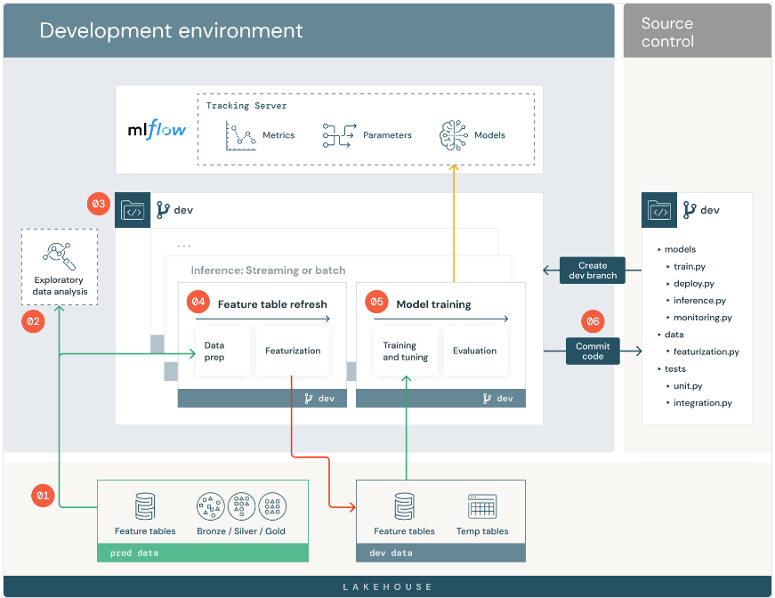
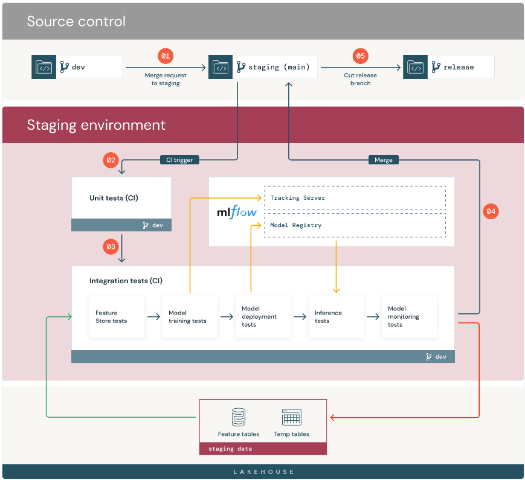
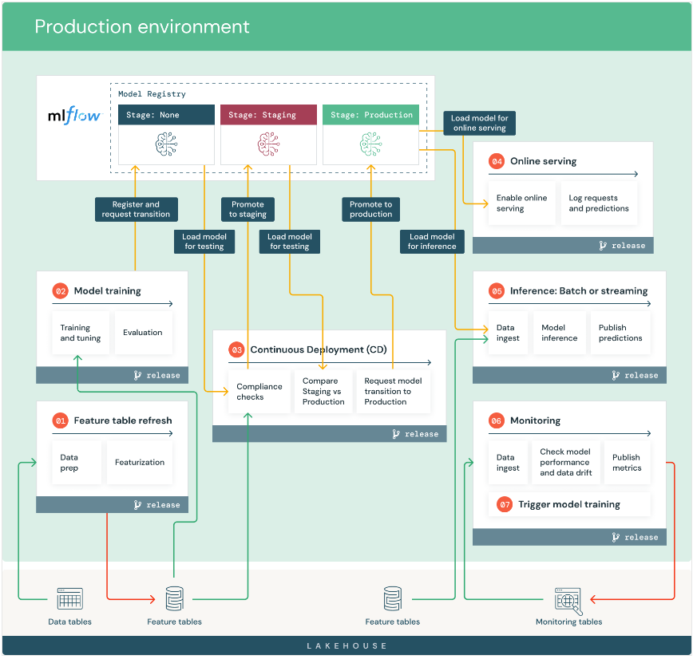

# MLOps
## MLFLOW:

- DataTalks Git repo
   https://github.com/DataTalksClub/mlops-zoomcamp

- DataTalks Youtube course
   https://www.youtube.com/playlist?list=PL3MmuxUbc_hIUISrluw_A7wDSmfOhErJK

## Development workflow 

## Staging workflow

## Production workflow

## Test
